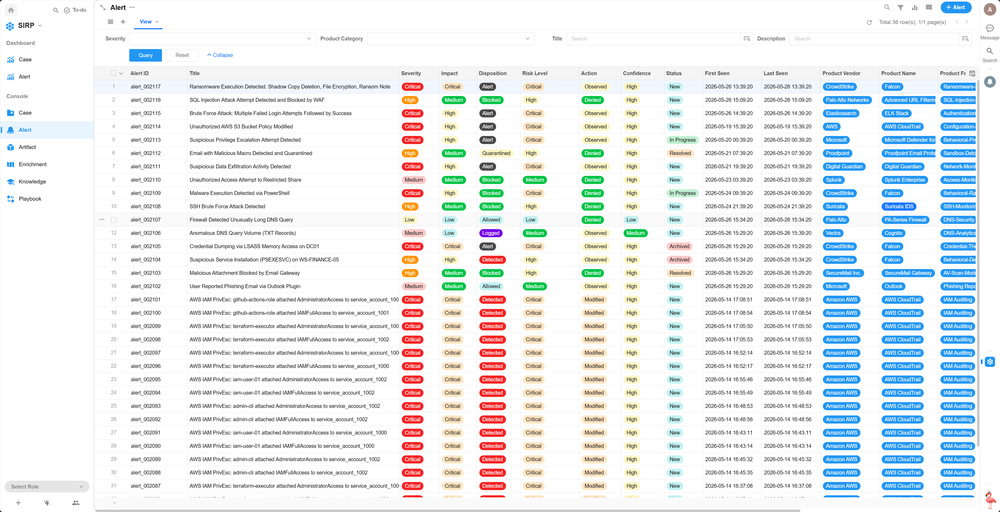
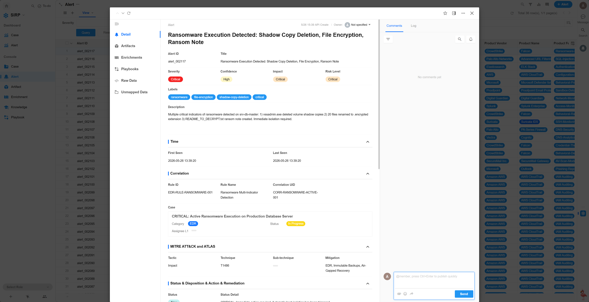
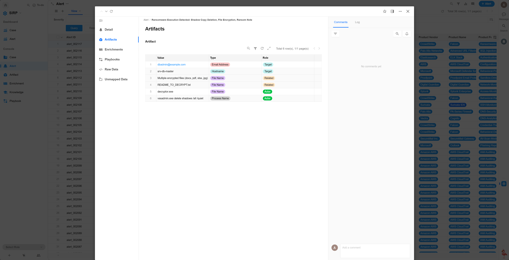

# Alert

- 集中展示所有告警记录.
- 默认告警中所有字段为只读,不可编辑.
- 分析员不会修改告警数据,只会基于告警数据进行调查和响应工作.

## View

> 支持多种筛选和排序功能.

## Detail

> Alert 操作面板

## Artifacts

> 相关的 Artifact 记录

## Enrichments

> 关联的 Enrichment 记录

## Raw Log

> 告警的原始日志内容.JSON 格式.

## Unmapped Data

> 原始告警中未进行映射的数据,默认 AI 不会分析该数据