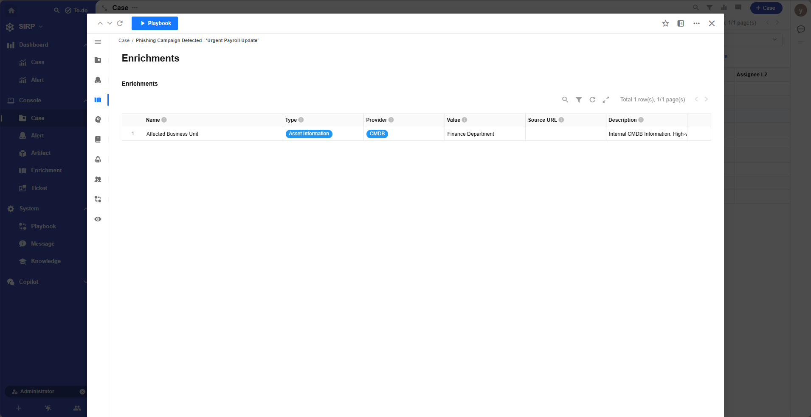
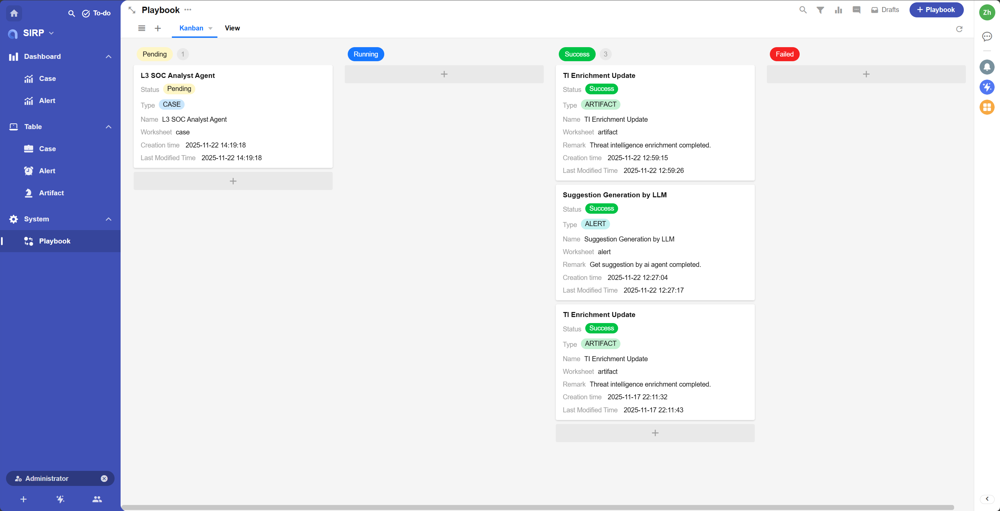

# Case

- 为应急响应人员提供了一个集中的视图,用于管理和跟踪安全事件的处理过程.
- 用户可以分配和更新安全工单,确保每个事件都得到及时和有效的处理.

## View

- 支持多种筛选和排序功能.

## Detail

> Case 操作面板,展示 Case 基础信息

## Enrichment

> Case 关联的所有 Enrichment 记录, 支持点击 Enrichment 记录查看详情

## Alert

> 与 Case 关联的所有告警, 支持点击 Alert 记录查看告警详情

## AI

> 展示 AI Agent 的分析结果

## Workbook

> Case 处理的操作手册,指导分析人员完成调查与响应工作,支持 Markdown 格式.
>
> Workbook 中可以使用 [] 等选项方式,方便分析人员逐步完成任务.

## Threat Hunting

> 威胁狩猎智能体输出的报告

> 威胁狩猎智能体的工具调用记录

## Playbook

> 与 Case 关联的自动化剧本记录.

## System

> 内部系统字段,仅供系统使用.

- Detect Time

检测用时

- Acknowledge Time

认领用时

- Respond Time

响应用时

- Deduplication Key

告警聚合关键字,用于将相似告警聚合为同一 Case.

## 操作日志

可以查看 Case 的变更记录,用于审计和追踪.

## 作战室

可以查看和参与 Case 相关的讨论,团队协作处理,也可作为该 Case 的作战室使用.

## 执行 Playbook

> Playbook 开发可参考 [Playbook 开发指南](../../../asp/PLAYBOOKS/development/)

- 打开详情页,点击左上角的 `Run Playbook` 按钮.

- 选择需要执行的 Playbook,点击 `确认` 按钮.

- 任务初始状态为 `Pending` ,等待调度执行.

- 任务执行过程中,状态为 `Running`.

- 任务执行完成后,状态为 `Success` 或 `Failed`,点击任务记录可查看执行详情.

