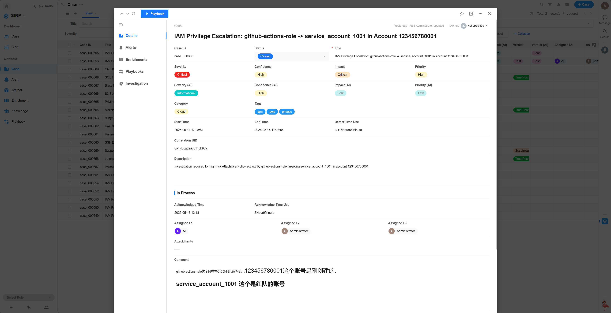
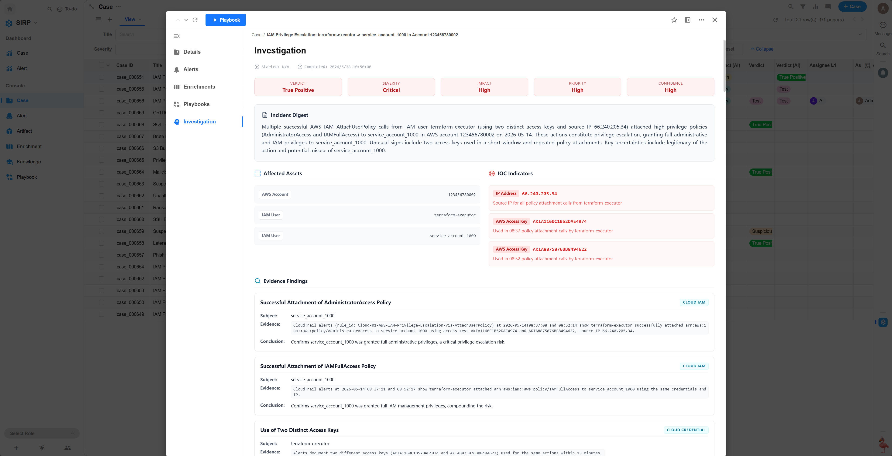
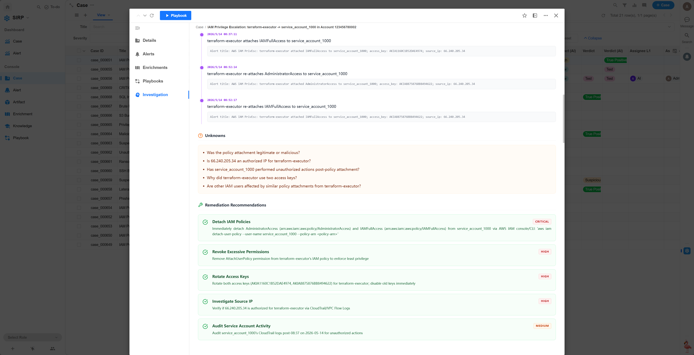

# Case

- 为应急响应人员提供了一个集中的视图,用于管理和跟踪安全事件的处理过程.
- 用户可以分配和更新安全工单,确保每个事件都得到及时和有效的处理.

## View

> 支持多种筛选和排序功能.

## Detail

> Case 操作面板,展示 Case 基础信息

## Alerts

> 与 Case 关联的所有告警, 支持点击 Alert 记录查看告警详情

## Enrichment

> Case 关联的所有 Enrichment 记录, 支持点击 Enrichment 记录查看详情

## Playbooks

> Case 关联的 Playbook 列表

## Investigation

> AI 分析的调查报告

## Log

可以查看 Case 的变更记录,用于审计和追踪.

## Comments

可以查看和参与 Case 相关的讨论,团队协作处理.

## Playbook

Playbook 开发可参考 [Playbook 开发指南](../../../asp/PLAYBOOKS/development/)

使用 Playbook 参考 [Playbook](../playbook/index.md)

