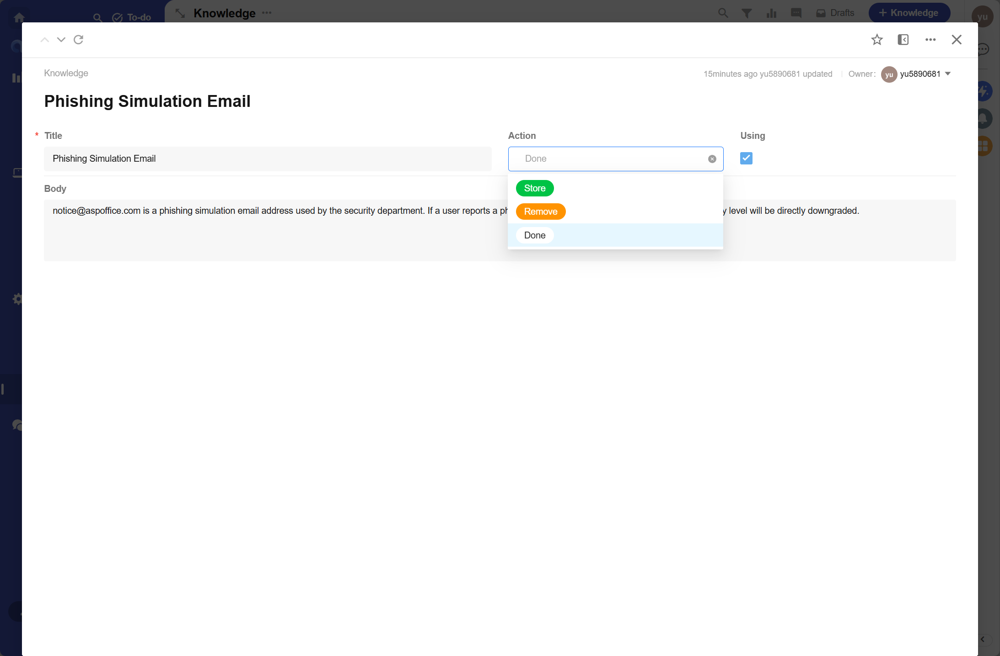

# Knowledge

存储和管理 SOC 团队的知识库,支持通过关键词搜索,AI Agent 可调用.

## View

## Detail

- Title

知识条目标题.

- Body

知识条目内容,支持 Markdown.

- Tags

知识标签,用于筛选和分类.

- Source

知识来源.`Manual` 为手动创建,`Case` 为从已结案的 Case 中自动提取(通过 Knowledge Extraction 剧本).

- Expires At

知识过期时间.留空表示永久有效,过期后不再参与搜索.

## 知识来源

- **手动创建**: 用户直接在平台中编写知识条目
- **Case 提取**: 对已结案 Case 执行 Knowledge Extraction 剧本,通过 LLM 从 Case 调查记录和讨论中提取可复用知识