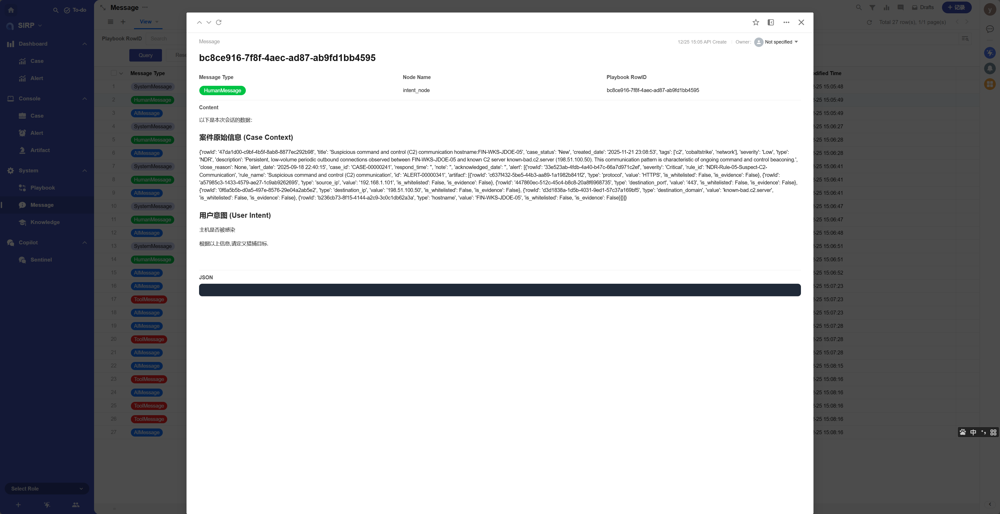
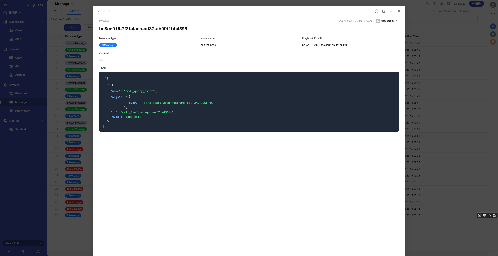
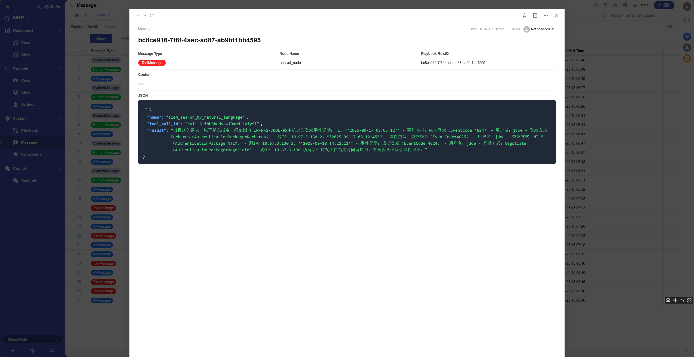

# Message

Agent 运行时 Message列表.

## View

## Detail

- Message Type

`SystemMessage` `HumanMessage` `AIMessage` `ToolMessage` 四种类型.

- Node Name

Langgraph 节点名称.

- Playbook RowID

执行的 Playbook ID.

- Content

Message 内容.

- JSON

Message 的 JSON 格式内容. 适配 Function Calling 时使用.

