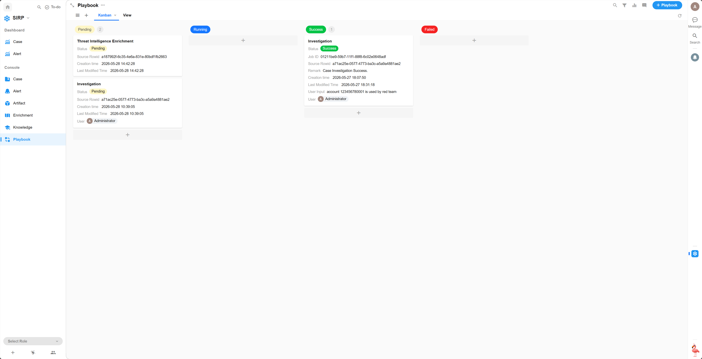
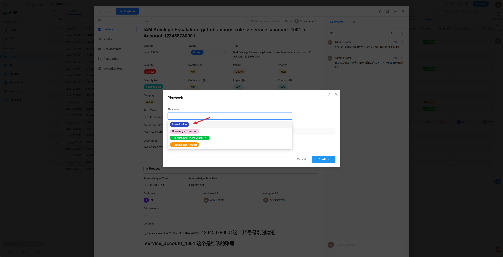
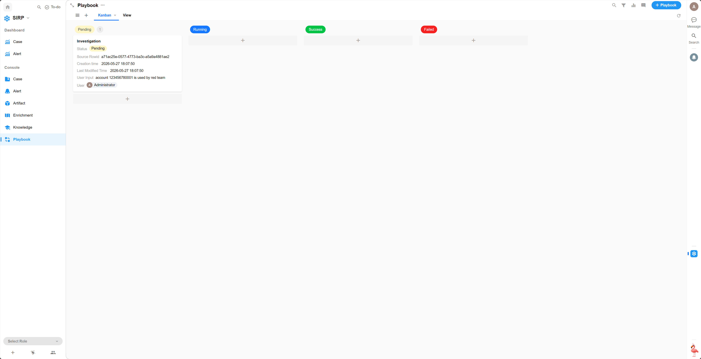
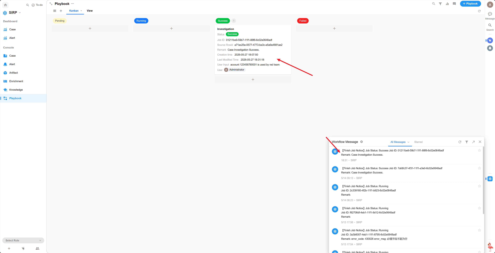

# Playbook

与 Alert/Case/Artifact 相关联的自动化剧本记录.

## Kanban / View

## Detail

- 选择 Case 打开详情页,点击左上角的 `Playbook` 按钮.
  

- 选择需要执行的 Playbook,点击 `确认` 按钮. 如果有额外需求可以使用自然语言在 User Input 中描述, LLM 在分析时会参考.
  
  

- 任务初始状态为 `Pending` ,等待调度执行.
  
  

- 任务执行过程中,状态为 `Running`.
  

- 任务执行完成后,状态为 `Success` 或 `Failed`,点击任务记录可查看执行详情.
  