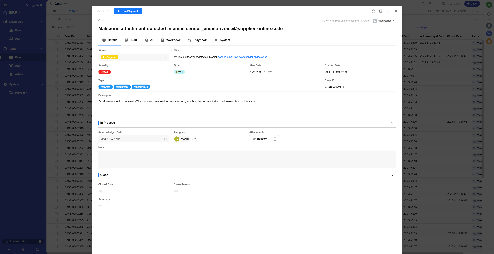

# 欢迎来到 SIRP

SIRP（Security Incident Response Platform）是 Agentic SOC Platform（ASP）中内置的安全编排与响应平台。它为安全团队提供了一个集中化、可视化的工作台，以高效地管理和响应安全事件。

## SIRP 与 ASP 的关系

在整个 Agentic SOC Platform（ASP）架构中，ASP 和 SIRP 扮演着相辅相成的角色：

- **ASP（后台框架）：** 作为强大的后端，ASP 提供了核心的自动化编排能力、AI Agent 支持以及与各类安全工具的集成能力。
- **SIRP（前端应用）：** 作为直观的前端，SIRP 将 ASP 的强大功能通过用户友好的界面呈现出来，帮助安全分析师处理告警、调查案件并执行响应动作。

简单来说，ASP 是引擎，而 SIRP 是驾驶舱。

## 核心特性

- **借鉴主流设计：** SIRP 的核心数据模型（Case/Alert/Artifact）和设计理念参考了业界领先的 SOAR 平台（如 Splunk SOAR、Swimlane SOAR），确保了工作流程的专业性和通用性。

- **高度灵活定制：** SIRP 基于 [Nocoly](https://www.nocoly.com) APaaS 平台构建。这意味着您可以轻松定制化几乎所有方面，包括：
    - **用户界面（UI）：** 调整布局、视图和字段。
    - **数据模型：** 添加自定义字段或创建新的数据关联。
    - **工作流程：** 设计和修改自动化的响应流程。
    - **报表仪表盘：** 创建满足特定需求的监控和报告视图。

- **无缝集成 ASP 能力：** SIRP 天然集成了 ASP 的所有自动化和智能能力，安全团队可以在界面中一键触发复杂的自动化剧本（Playbook）和 AI 分析 Agent。

## 平台概览

